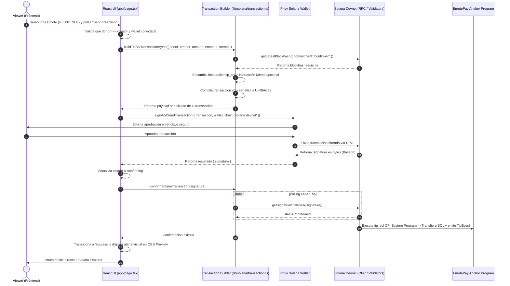

# Guía de Estudio y Explicación Técnica: Flujo de Donaciones en Solana (EmotePay)

Este documento detalla la arquitectura, fundamentos teóricos y flujo de ejecución implementados en la migración de **EmotePay** hacia **Solana Devnet**, contrastando los conceptos nativos de Solana con el modelo EVM tradicional.

---

## 1. Resumen de Cambios Realizados

| Archivo | Acción | Rol en el Flujo |
| :--- | :--- | :--- |
| [`specs/003-solana-devnet-tipping.md`](file:///d:/hackathon/Emotepay-Solana/specs/003-solana-devnet-tipping.md) | **Creado** | Especificación formal del flujo transaccional bajo metodología SDD (Requerimientos `REQ-001` a `REQ-006`, Criterios de Aceptación y Matriz de Trazabilidad). |
| [`lib/emotes.ts`](file:///d:/hackathon/Emotepay-Solana/lib/emotes.ts) | **Modificado** | Migración del modelo de datos: reemplazo de denominaciones de Monad (`amountMon`) por `amountSol` y cálculo exacto en lamports utilizando enteros de 64 bits (`lamports: bigint`). |
| [`lib/payment.ts`](file:///d:/hackathon/Emotepay-Solana/lib/payment.ts) | **Modificado** | Adaptación del ciclo de vida del pago (`PaymentState`): soporte para estados `signing`, `confirming`, `success` y `error`, reemplazo de hash `0x${string}` por firma Base58 de Solana (`signature: string`) y generador de URL al Solana Explorer. |
| [`lib/solana/config.ts`](file:///d:/hackathon/Emotepay-Solana/lib/solana/config.ts) | **Modificado** | Exportación del Program ID verificado de EmotePay (`EQEjzX3Kd2JpMzqK9gF32gznDonmLtcuj7fMot4w22nL`) y de la instancia tipada de RPC Devnet (`@solana/kit`). |
| [`lib/solana/transaction.ts`](file:///d:/hackathon/Emotepay-Solana/lib/solana/transaction.ts) | **Creado** | Núcleo transaccional de Solana: serializador Borsh de la instrucción Anchor `tip_sol`, inyector opcional de memo (`@solana-program/memo`), compilador de mensajes de transacción versión 0 (`v0`), formateador de firmas y polling de confirmación con nivel de compromiso `confirmed`. |
| [`app/page.tsx`](file:///d:/hackathon/Emotepay-Solana/app/page.tsx) | **Modificado** | Desbloqueo de la interfaz de usuario: cableado de `useSignAndSendTransaction` de Privy Solana, validaciones reactivas (anti self-tip, creador configurado), retroalimentación visual interactiva y trigger de animación en el Stream Overlay Simulator. |

---

## 2. Fundamentos Teóricos: Solana vs. EVM

### 2.1. Cuentas vs. Estado Global EVM (Stateless Programs)
En **Ethereum y redes EVM**, los smart contracts combinan lógica y estado: un contrato contiene su propio almacenamiento (`storage layout`), su saldo de gas/ether y sus funciones. Cada lectura o modificación de variables muta el árbol de estado global (Merkle Patricia Trie).

En **Solana**, los programas son **completamente stateless (sin estado)**:
- Los programas son únicamente ejecutables de código compilado a BPF/SBF (`executable: true`), marcados como de solo lectura.
- **Todo es una Cuenta (`Account`):** Los balances de SOL, las cuentas de datos y los programas mismos son cuentas en la red.
- **System Program (`11111111111111111111111111111111`):** Es el programa nativo de Solana responsable de crear nuevas cuentas, asignarles espacio y transferir SOL nativo (lamports) entre cuentas normales.
- **Cross-Program Invocation (CPI):** En EmotePay, nuestro Anchor Program no guarda los fondos en una tesorería propia ni custodia el dinero. En su lugar, invoca una instrucción `transfer` del **System Program** transfiriendo directamente los lamports desde la cuenta del `donor` (firmante) hacia la cuenta del `creator` (writable).

### 2.2. Lamports y Conversiones: Precisión con `BigInt` (u64)
En finanzas de blockchain, **los números de punto flotante de JavaScript (`number` con formato IEEE-754) son peligrosos** debido a problemas de precisión de redondeo (ej. `0.1 + 0.2 === 0.30000000000000004`).

- La unidad atómica mínima en Solana es el **Lamport** (en honor a Leslie Lamport).
- Relación:
  $$\mathbf{1 \text{ SOL} = 10^9 \text{ lamports} = 1,000,000,000 \text{ lamports}}$$
- En Rust, el monto se modela como un entero sin signo de 64 bits (`u64`), cuyo valor máximo es $2^{64}-1 \approx 1.84 \times 10^{19}$.
- En el cliente TypeScript, utilizamos el tipo nativo **`bigint`** (ej. `1_000_000n` para 0.001 SOL) garantizando que no se pierda precisión ni ocurran desbordamientos aritméticos al serializar la instrucción.

### 2.3. Firmas Base58 vs. Hashes Hexadecimales (`0x`)
- **EVM (Ethereum/Monad):** El identificador de una transacción es el **hash keccak256** del payload RLP de la transacción completa. Por convención, se expresa como una cadena hexadecimal prefijada por `0x` de 64 caracteres hex (32 bytes).
- **Solana:** El identificador principal de una transacción no es un hash arbitrario, sino la **primera firma criptográfica (Signature)**, correspondiente a la del **Fee Payer**.
  - Utiliza el esquema de curvas elípticas **Ed25519**.
  - La firma tiene una longitud exacta de **64 bytes**.
  - Se codifica usando el alfabeto **Base58** (que omite caracteres visualmente ambiguos como `0`, `O`, `I`, `l`), resultando en una cadena de 87-88 caracteres alfanuméricos sin prefijo `0x`.

### 2.4. Arquitectura Anchor e Instrucciones
Anchor es el framework estándar de Solana para Rust. Para garantizar que una instrucción se ejecute en el handler correcto, Anchor aplica una serialización estricta mediante **Borsh**:

1. **Discriminador de Instrucción (8 bytes):**
   Anchor calcula los primeros 8 bytes del hash SHA-256 de la cadena `"global:<nombre_de_la_instruccion>"`.
   $$\text{SHA-256}(\text{"global:tip_sol"})[0..8] = \texttt{[0x6f, 0x51, 0x91, 0xff, 0xeb, 0xe5, 0x67, 0x4b]}$$
2. **Serialización de Argumentos (Little-Endian):**
   - `amount`: `u64` (8 bytes en orden Little-Endian).
   - `emote_id`: `u16` (2 bytes en orden Little-Endian).
   - Longitud total de los datos de la instrucción (`instruction.data`):
     $$8 \text{ (discriminador)} + 8 \text{ (amount)} + 2 \text{ (emote\_id)} = \mathbf{18 \text{ bytes}}$$
3. **Struct de Cuentas (`AccountMeta`):**
   Solana requiere que la transacción declare explícitamente qué cuentas serán leídas o modificadas para que el runtime (Sealevel) pueda paralelizar la ejecución de transacciones:
   - `donor`: Firmante (`isSigner: true`) y Mutable (`isWritable: true`).
   - `creator`: Destinatario Mutable (`isWritable: true`), no firmante.
   - `system_program`: Programa de Sistema (`isWritable: false`, `isSigner: false`).

---

## 3. Flujo de Ejecución Paso a Paso

---

## 4. Guía de Retención y Buenas Prácticas

### 4.1. Expiración de Blockhashes
- **Qué ocurre:** En Solana, las transacciones no usan un `nonce` secuencial por cuenta como en EVM. Usan un **Recent Blockhash** como comprobante de frescura temporal (vigente durante ~150 slots o ~60-90 segundos).
- **Buena práctica:** Obtener siempre el blockhash inmediatamente antes de solicitar la firma del usuario. Si el usuario tarda demasiado en aceptar el modal de Privy, la transacción expirará con `BlockhashNotFound`.

### 4.2. Doble Pago por Reintentos Ciegos (Anti-Double Spending)
- **Error común:** Si una petición RPC lanza un timeout de red, reenviar la transacción inmediatamente sin verificar el estado de la firma.
- **Riesgo:** Si el validador procesó la primera transacción pero el cliente solo perdió la respuesta HTTP, el reintento enviará una segunda transacción descontando fondos duplicados.
- **Buena práctica:** Ante un timeout, consultar primero `getSignatureStatuses([signature])`. Si la firma ya fue confirmada, tratar la operación como exitosa.

### 4.3. Validación Previa al Envío (Pre-flight Checks)
- Validar siempre en la UI que la cuenta del donante tenga saldo suficiente para cubrir el monto del tip más la comisión de red (~5,000 lamports / 0.000005 SOL).
- Comprobar que el usuario no intente autodonarse (`self-tipping`), ya que el contrato Anchor rechazará la transacción con el error onchain `SelfTipNotAllowed`, desperdiciando la comisión de gas del usuario.

### 4.4. Preservación del Stack y Dependencias
- Mantener la versión verificada de **`@solana/kit 5.5.1`** junto con **`@privy-io/react-auth`**. No introducir librerías de cliente contradictorias (`@solana/web3.js` legacy v1) salvo que una fase futura apruebe una migración completa de dependencias.
